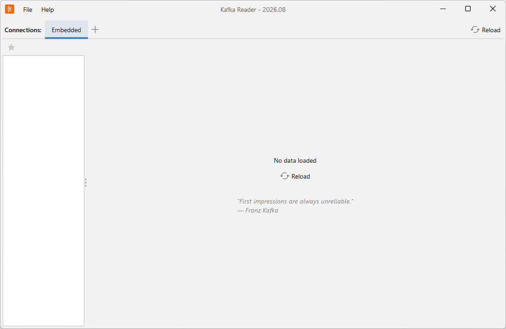
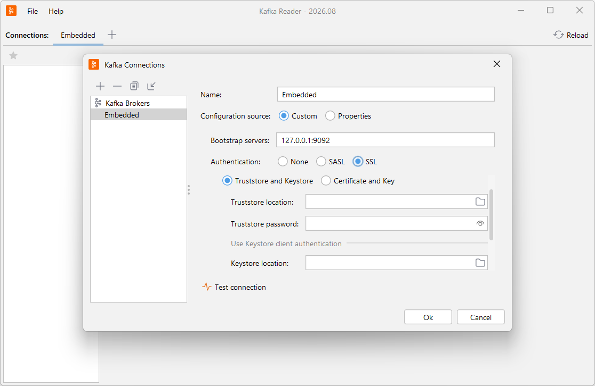
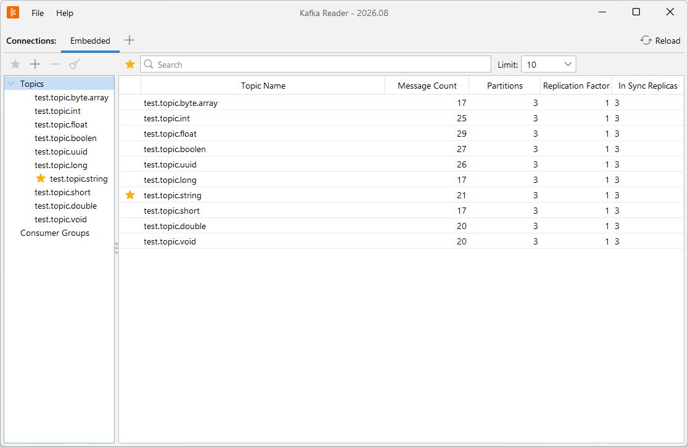
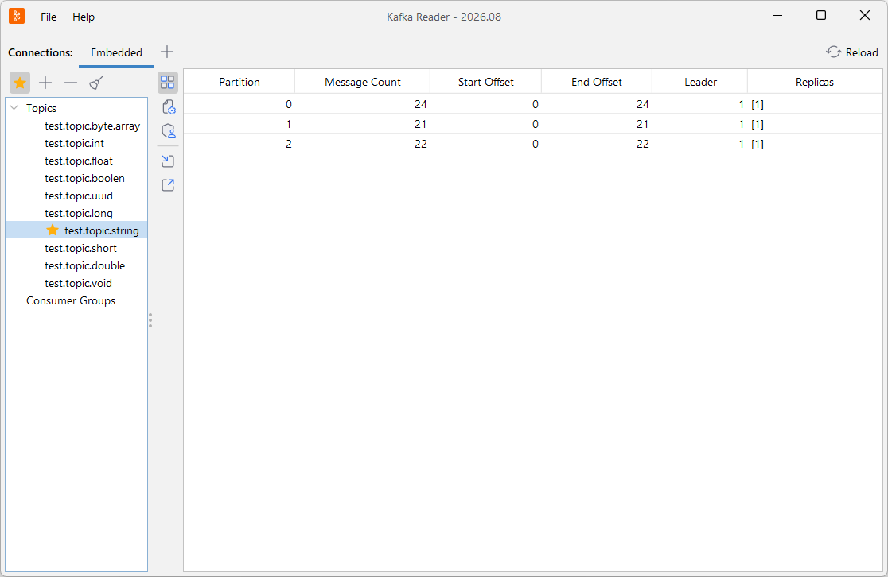
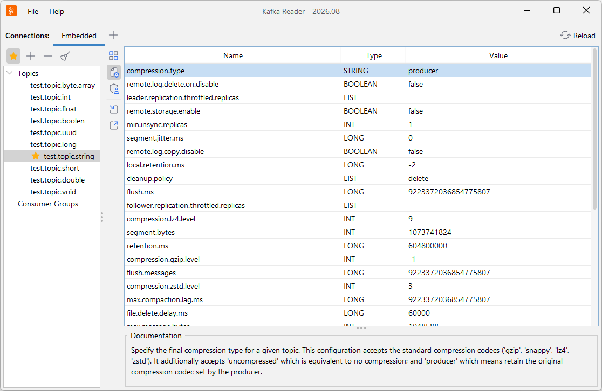
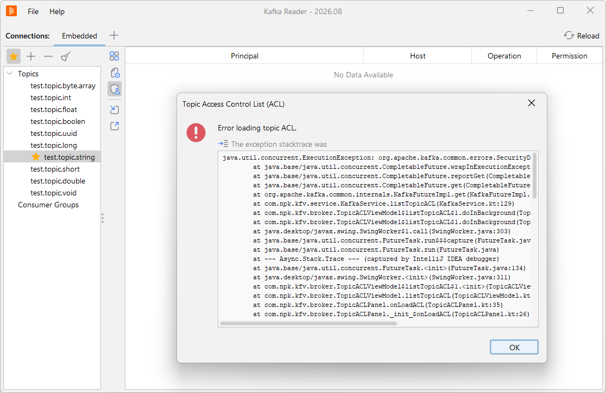
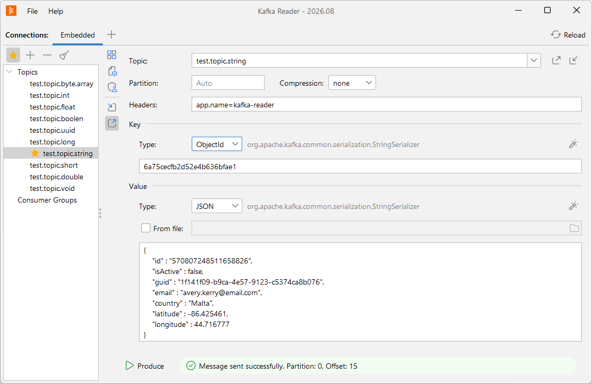
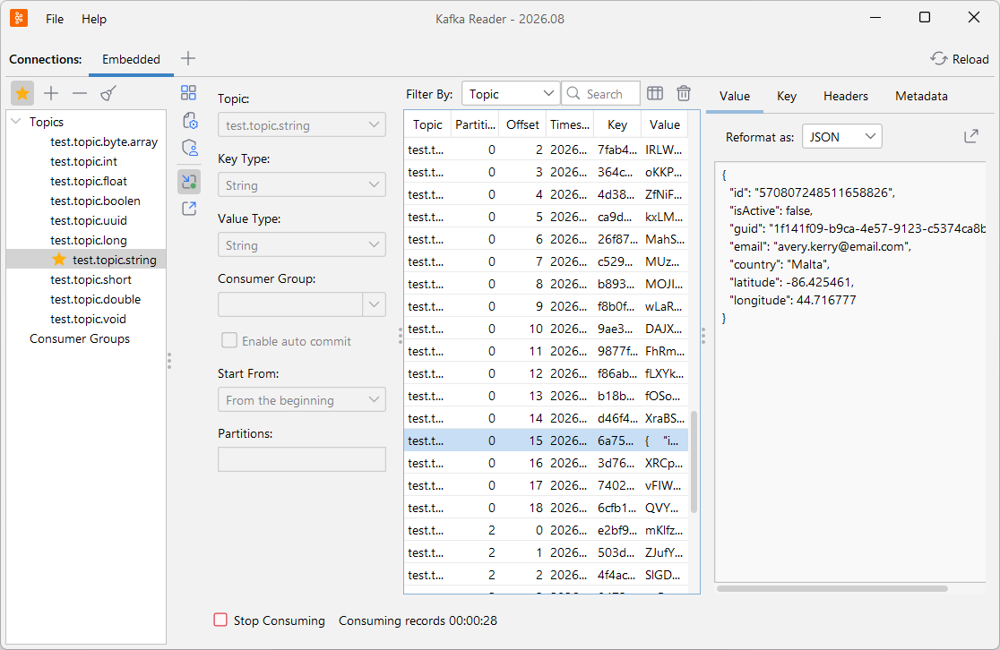

 Kafka Reader
===
[](LICENSE)
[]()
[](https://github.com/akolomiets/kafka-reader/releases)

A simple client for Apache Kafka. The application provides support for multiple clusters, allowing you to manage topics, publish and receive messages, and perform various Kafka-related operations.

# Features
### Topics Management
* Display topic information and configuration
* Create, delete, and clean topic
* Show Topic Access Control list 
* Search topic
* Work with favorite topics

### Groups Management
* Display group information
* Delete and modify consumer group
* Search consumer group
* Work with favorite consumer groups

### Message Consumption
* Consume messages using different strategies
* Read the latest messages from a topic
* Read messages from a specific partition
* Filter consumed messages by any filter
* Reformat message key/value as JSON or XML
* Export message key/value to a file

### Message Publishing
* Publish String/ByteArray serialized messages
* Publishing in the specific partition
* Support for compression selection
* Modify message headers
* Generate key/value random data
* Save the publishing message to a file
* Load the publishing message from a file

> [!WARNING]
> Schema Registry is not supported 

# Requirements
* Java 25 or newer
* Kafka (version 3.x or newer) or Azure Event Hubs 

# Getting Started
You can run the Kafka Reader via cmd file, or jar directly.

## Running from cmd
```shell
kafka-reader.cmd
```
**Note:** jvm configuration is available in the `kafka-reader.jvm`

## Running from jar
```shell
javaw -jar kafka-reader.jar
```

# The Interface
Kafka Reader wraps major functions with an intuitive user interface inspired by JetBrains products.



<details>
    <summary><b>Connection Configuration</b></summary>
    
</details>

<details>
    <summary><b>Topics List</b></summary>
    
</details>

<details>
    <summary><b>Topic Details</b></summary>
    
</details>

<details>
    <summary><b>Topic Properties</b></summary>
    
</details>

<details>
    <summary><b>Topic Access Control List (ACL)</b></summary>
    
</details>

<details>
    <summary><b>Produce Message</b></summary>
    
</details>

<details>
    <summary><b>Consume Messages</b></summary>
    
</details>
